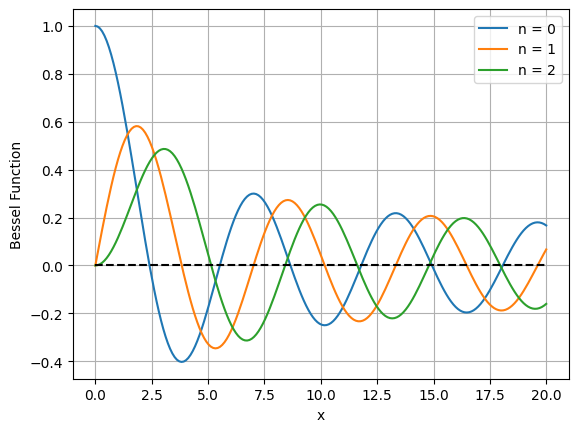
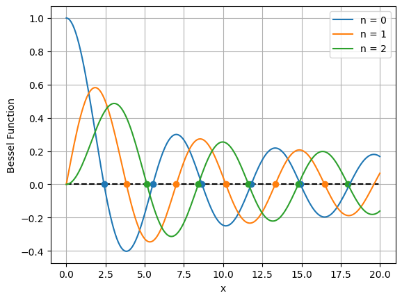

# Applications of the Roots of Bessel Functions of the First Kind

This project explores how **Bessel functions of the first kind (Jn)** and their roots appear in real-world physics — from **vibration modes of circular drumheads** to **frequency modulation (FM) synthesis** and **planetary motion** in **Kepler’s equation**.  
Using Python’s SciPy library, we numerically compute and visualize the first five roots for orders *n = 0, 1, 2*.

---

## Authors
Madeline Renee Boss
\nSamhitha Devi Kunadharaju
\n*University of Texas at Austin*
\n*Course: CS 323E – Elements of Scientific Computing*

---

## Overview

<p align="center">
  
</p>

The Bessel differential equation defines oscillatory solutions that naturally arise in problems with cylindrical or radial symmetry.  
We compute the first five roots of \( J_0(x), J_1(x), J_2(x) \) using SciPy’s `quad()` and `fsolve()` methods, then visualize how these roots relate to physical systems such as:

1. Vibrations of a circular drumhead  
2. Frequency modulation (FM) signal synthesis  
3. Harmonic suppression in Kepler’s planetary equation  

---

## Included Files

| File | Description |
|------|--------------|
| **`bessel_roots_analysis.ipynb`** | Jupyter/Colab notebook that computes and visualizes Bessel functions and their roots |
| **`P2.pdf`** | Full paper detailing mathematical background and physical applications |
| **`images/bessel_functions_plot.png`** | Visualization of J₀(x), J₁(x), and J₂(x) |
| **`images/bessel_roots_plot.png`** | Visualization showing computed roots for n = 0, 1, 2 |
| **`requirements.txt`** | List of dependencies (NumPy, Matplotlib, SciPy) |

---

## Visualizations

| Bessel Functions | Computed Roots |
|------------------|----------------|
|  |  |

**Left:** Plots of \(J_0(x)\), \(J_1(x)\), and \(J_2(x)\) showing their oscillatory behavior.  
**Right:** The same functions with their first five roots marked using SciPy’s `fsolve()`.

---

## Setup

Install dependencies:
```bash
pip install -r requirements.txt

